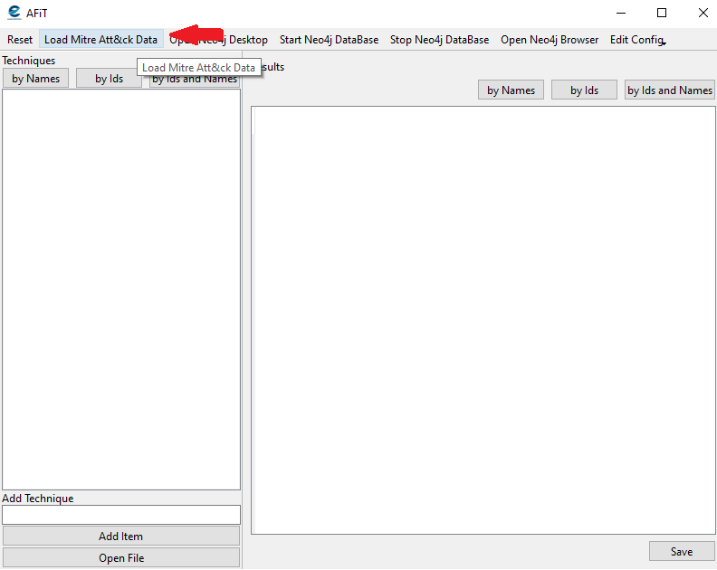

# install AFiT

AFiT runs on **python 3.9.** Make sure it is installed on your machine before following the installation steps.
AFiT use neo4j , wich need the latest version of **java development kit**
## install
1. Git clone the repository
For windows run AFiT.exe in AFiT-windows folder.
And for ubuntu run AFiT in AFiT-ubuntu folder.
# First use
On first use of AFiT, you have to load MitreAttack data to have the database up to date.

## First,start Neo4j 

## Then load MitreAttAck

## load Mitre Att&ck

## To open an example, click to open file, then select example.txt

## Now it's working so you can open Neo4j in web browser if you want

## Error
when you run for the first time you can maybe have this error

    AFiT\neo4j\bin\neo4j.ps1 cannot be loaded because running scripts is disabled on this system
To fix it you need to allow running this script with this command in the powershell

    Set-ExecutionPolicy RemoteSigned -Scope CurrentUser

